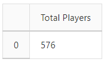
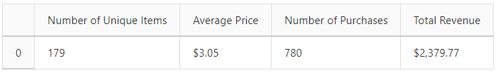
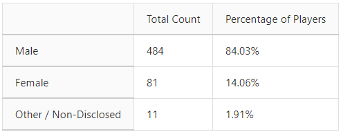
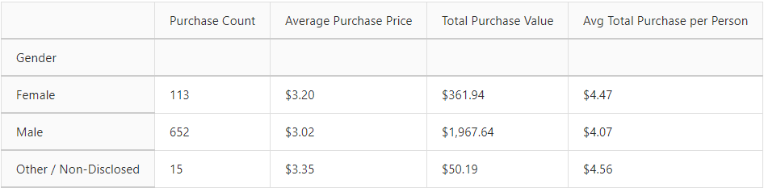
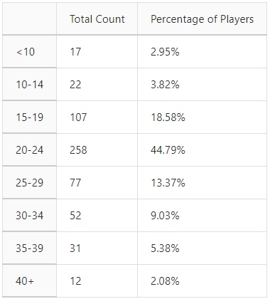
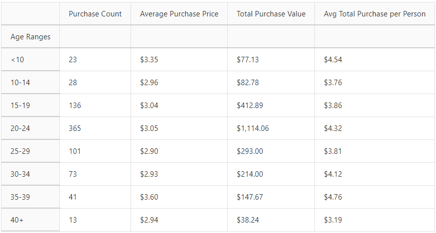
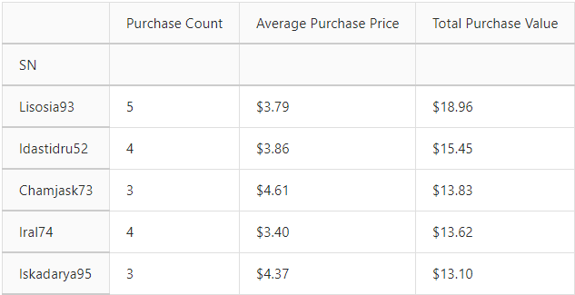
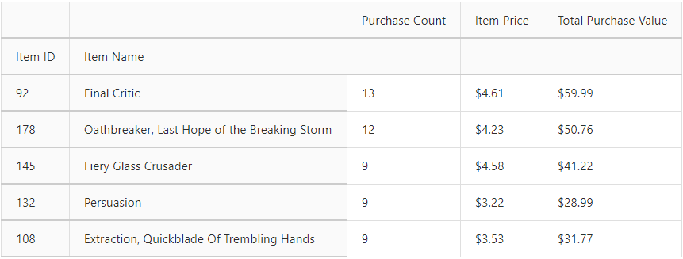
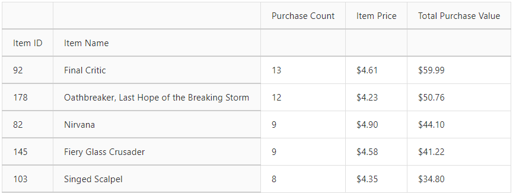

# Pandas Homework - Pandas, Pandas, Pandas

## Background
A new repository for this project called pandas-challenge was created and was cloned to my computer.
Inside my local git repository, "HeroesOfPymoli" directory was created with the Jupyter notebook "HeroesOfPymoli_starter.ipynb."
The "Resources" folder contains the CSV files "purchase_data" that was used.

## Heroes of Pymoli

Like many others in its genre, the game is free-to-play, but players are encouraged to purchase optional items that enhance their playing experience. As my first task, I have generate a report that breaks down the game's purchasing data into meaningful insights.

The final reports includes each of the following:

### Jupyter Notebook Link

http://localhost:8890/notebooks/HeroesOfPymoli/HeroesOfPymoli_starter.ipynb#

## Player Count

   * Total Number of Players

## Purchasing Analysis (Total)

   * Number of Unique Items
    
   * Average Purchase Price
    
   * Total Number of Purchases
    
   * Total Revenue
   

## Gender Demographics

   * Percentage and Count of Male Players

   * Percentage and Count of Female Players

   * Percentage and Count of Other / Non-Disclosed
   
 

## Purchasing Analysis (Gender)

#### The below each broken by gender

   * Purchase Count
   
   * Average Purchase Price
   
   * Total Purchase Value

   * Average Purchase Total per Person by Gender
   
 
 
   
## Age Demographics

#### The below each broken into bins of 4 years (i.e. <10, 10-14, 15-19, etc.)

   * Total Count

   * Percentage of Players

   

## Age Demographics

#### The below each broken into bins of 4 years (i.e. <10, 10-14, 15-19, etc.)

  * Purchase Count

  * Average Purchase Price

  * Total Purchase Value

  * Average Purchase Total per Person by Age Group

 

## Top Spenders

   * SN

   * Purchase Count

   * Average Purchase Price

   * Total Purchase Value

## Most Popular Items

  * Item ID

  * Item Name

  * Purchase Count

  * Item Price

  * Total Purchase Value

## Most Profitable Items

  * Item ID
  
  * Item Name
  
  * Purchase Count
  
  * Item Price
  
  * Total Purchase Value

## Observation Trends

  * The majority of the Players are Males. Totalling 70% more Male Players than Female Players. 
  * Although Males purchase more games than Female, Female's Average Purchase Price is higher by $0.18 than Males. 
  * The highest age group of Players are between the ages 20 - 24, overall 45% of the total age group.
  * Final Critic is the Most Popular and Most Profitable Game.
  
  
